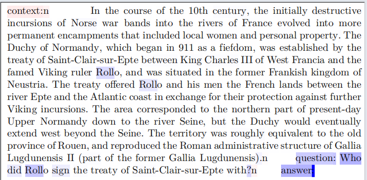
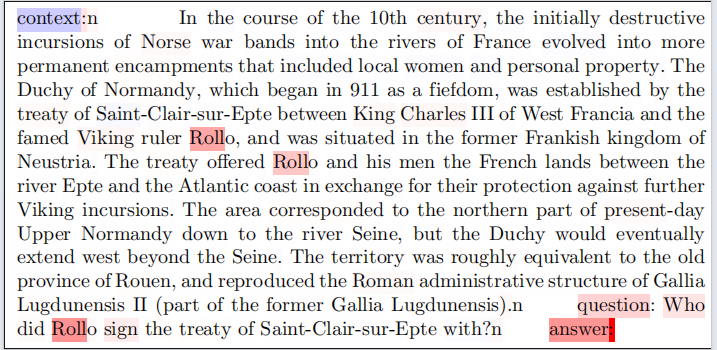

# Explanations of LLM — AttnLRP on GPT-2

NLP course project (Topic 7). We apply **AttnLRP** [Achtibat et al., ICML 2024] to GPT-2 at
three levels: tokens, the effect of fine-tuning, and model parameters. Key contributions:
(1) a **contrastive gradient masking** fix for GPT-2's negative-logit sign-flip artifact,
(2) token-level faithfulness evaluation before and after fine-tuning on **both SQuAD v2 and SciQ**,
and (3) **parameter-level attribution** aggregated by layer, component, and attention head.

## References

- [1] Bach et al., *Layer-wise Relevance Propagation*, PLOS ONE 2015.
- [2] Achtibat et al., *AttnLRP: Attention-Aware Layer-wise Relevance Propagation for Transformers*, ICML 2024.
- [3] Blücher et al., *Decoupling pixel flipping and occlusion strategy for consistent XAI benchmarks*, 2024.
- Reference implementation: <https://github.com/rachtibat/LRP-eXplains-Transformers>

## Data

Both datasets are publicly available and loaded automatically via `datasets.load_dataset()` from Hugging Face Hub — no manual download required.

| Dataset | Description | Access | License |
|---------|------------|--------|---------|
| SQuAD v2 | Extractive QA, 130k train / 4k dev | [HuggingFace](https://huggingface.co/datasets/rajpurkar/squad_v2) | CC BY-SA 4.0 |
| SciQ | 4-choice science MC, 12k train / 1k test | [HuggingFace](https://huggingface.co/datasets/allenai/sciq) | CC BY-NC 4.0 |

**Model:** GPT-2 base (124M) — [openai-community/gpt2](https://huggingface.co/openai-community/gpt2)

## Project layout

```
Explanations-of-LLM/
├── configs/
│   ├── gpt2_efficient.yaml                    # base GPT-2 on SQuAD v2
│   ├── gpt2_efficient_finetuned_squad.yaml    # FT-SQuAD checkpoint
│   └── gpt2_efficient_finetuned_sciq.yaml     # FT-SciQ checkpoint
├── main.py                                    # Parts 1 & 3 entry point
├── requirements.txt
├── README.md
├── RUNNING.md                                 # all runnable commands
├── Team_Work_Allocation_Statement_LLM.md
├── figures/                                   # results & visualizations (38 files)
│   ├── fig_signfix_before.png / after.png     # sign-fix demo
│   ├── fig_squad_tokens_*.png                 # SQuAD token comparisons
│   ├── fig_squad_layers_*.png                 # SQuAD layer heatmaps
│   ├── fig_sciq_tokens_*.png                  # SciQ token comparisons
│   ├── fig_loss_curves.png                    # training loss
│   ├── fig_accuracy.png                       # token accuracy
│   ├── fig_faithfulness_auc.png               # MoRF/LeRF over training
│   ├── fig_gaps_over_steps.png                # comprehensiveness & sufficiency
│   ├── fig_params_squad_*.png                 # SQuAD parameter attribution
│   ├── fig_params_sciq_*.png                  # SciQ parameter attribution
│   ├── fig_case_*_heads.png                   # head-level case studies
│   ├── sample_NNN_param_heads.png (×8)        # appendix head maps
│   ├── heatmap_sample_NNN.pdf (×8)            # appendix token PDFs
│   └── faithfulness_*.json (×4)               # per-experiment AUC summaries
├── scripts/
│   ├── train_gpt2_qa.py                       # Part 2 fine-tuning
│   ├── plot_finetune.py                       # training-curve plots
│   ├── squad_answer_compare.py                # SQuAD generation comparison
│   ├── test_mask.py                           # lxt PDF heatmaps (contrastive)
│   ├── test_no_mask.py                        # lxt PDF heatmaps (no mask)
│   └── visualize_everest_prompt.py            # Everest QA demo heatmaps
├── third_party/
│   └── LRP-eXplains-Transformers/             # vendored lxt fallback
└── src/
    ├── data/
    │   ├── squad_loader.py                    # SQuAD v2 prompt loader
    │   └── sciq_loader.py                     # SciQ prompt loader
    ├── models/
    │   └── gpt2_attnlrp_loader.py             # GPT-2 + lxt monkey_patch
    ├── explain/
    │   ├── attnlrp_gpt2_efficient.py          # token/layer AttnLRP (contrastive)
    │   ├── attnlrp_gpt2_efficient_Part1.py    # Part 1 variant (no mask)
    │   └── parameter_attribution.py           # Part 3 parameter attribution
    ├── evaluate/
    │   ├── faithfulness.py                    # MoRF / LeRF AUC
    │   └── next_token_faithfulness.py         # Part 2 eval helper
    └── visualize/
        └── relevance_plots.py                 # all figure functions
```

## Setup

```bash
conda create -n llm-xai-paper python=3.10 -y
conda activate llm-xai-paper
pip install -r requirements.txt
```

## How it works

### AttnLRP with contrastive gradient masking

We load GPT-2 and patch it via `lxt.efficient.monkey_patch`, then propagate LRP relevance
through a single backward pass. The key fix for GPT-2 is the contrastive gradient seed:

```python
contrastive_seed = torch.full_like(next_token_logits, -1.0 / V)  # V = vocab size
contrastive_seed[target_id] = 1.0
next_token_logits.backward(contrastive_seed)
```

GPT-2's logits are predominantly negative due to tied embeddings and large-vocabulary
suppression. A plain `max_logits.backward()` produces inverted relevance signs and
reversed MoRF/LeRF ordering. The contrastive mask sets the target gradient to +1 and
all others to −1/V, which is mathematically equivalent to explaining
`softmax(y)_t − mean(softmax(y))` — see `figures/fig_signfix_before.png` and
`figures/fig_signfix_after.png` for a before/after comparison.

Relevance readout:
- **Token relevance**: `(input_embeds * input_embeds.grad).sum(-1)`
- **Layer relevance**: `(hidden * hidden.grad).sum(-1)` via retained forward hooks
- **Parameter relevance** (Part 3): `param * param.grad` aggregated by layer, component,
  and attention head

### Faithfulness (Blücher et al., 2024)

Token-flipping AUC at 20 flip levels:
- **MoRF** — remove most-relevant-first. Lower AUC ⇒ more faithful.
- **LeRF** — remove least-relevant-first. Higher AUC ⇒ more faithful.

We also compute comprehensiveness and sufficiency gaps relative to a random baseline:

```
Δ_Comp = AUC_rand_MoRF − AUC_MoRF    (positive = top tokens carry evidence)
Δ_Suff = AUC_LeRF − AUC_rand_LeRF    (positive = bottom tokens are dispensable)
```

These gaps remove the confidence-shift confound: both the model and the random baseline
rise after fine-tuning, so gap growth reflects genuine ranking improvement.

## Results

50 validation samples per configuration, GPT-2 base (124M), fp32, single GPU.

### Sign-fix




Default initialization on GPT-2 produces inverted relevance signs. Contrastive masking
restores the expected highlight on context evidence tokens.

### Faithfulness: MoRF/LeRF AUC

| Configuration | AUC_MoRF ↓ | AUC_rand | AUC_LeRF ↑ |
|---|---:|---:|---:|
| Base → SciQ | 0.004 | 0.026 | 0.071 |
| FT-SciQ → SciQ | 0.023 | 0.251 | 0.462 |
| Base → SQuAD v2 | 0.006 | 0.049 | 0.089 |
| FT-SQuAD → SQuAD v2 | 0.018 | 0.343 | 0.790 |

All four configurations pass both directions of the Blücher sanity check.

### Comprehensiveness & sufficiency gaps

| Configuration | Δ_Comp | Δ_Suff |
|---|---:|---:|
| Base → SciQ | 0.022 | 0.039 |
| FT-SciQ → SciQ | **0.228** (×10.4) | **0.186** (×4.8) |
| Base → SQuAD v2 | 0.043 | 0.038 |
| FT-SQuAD → SQuAD v2 | **0.325** (×7.5) | **0.444** (×11.7) |

Both gaps grow substantially after fine-tuning, ruling out a pure confidence-shift
explanation. See `figures/fig_faithfulness_auc.png` and `figures/fig_gaps_over_steps.png`
for the co-evolution of faithfulness with training.

### Fine-tuning dynamics

| Figure | Description |
|--------|-------------|
| `fig_loss_curves.png` | Training loss (SQuAD ~36k steps, SciQ ~2.2k steps) |
| `fig_accuracy.png` | Token accuracy (SQuAD →85%, SciQ →93.5%) |
| `fig_faithfulness_auc.png` | MoRF/LeRF AUC over training steps |
| `fig_gaps_over_steps.png` | Δ_Comp and Δ_Suff over training steps |

### Token-level: before vs. after fine-tuning

| Figure | Description |
|--------|-------------|
| `fig_squad_tokens_base.png` + `_ft.png` | SQuAD v2: relevance shifts from prompt scaffolding to evidence tokens |
| `fig_squad_layers_base.png` + `_ft.png` | SQuAD v2: layer-wise view, migration concentrated in upper layers |
| `fig_sciq_tokens_base.png` + `_ft.png` | SciQ: relevance shifts from question scaffolding to option letter |

### Parameter-level attribution

| Figure | Description |
|--------|-------------|
| `fig_params_squad_base.png` + `_ft.png` | SQuAD v2: fine-tuning concentrates additional relevance in **late-stage attention** |
| `fig_params_sciq_base.png` + `_ft.png` | SciQ: fine-tuning concentrates additional relevance in **late-stage MLP** |

The task-specific divergence suggests SQuAD v2's extractive QA relies on
context-conditioned routing (attention), while SciQ's multiple-choice format relies more
on parametric knowledge retrieval (MLP).

### Case studies: head-level signatures

| Figure | Description |
|--------|-------------|
| `fig_case_numeric_heads.png` | Numeric answers activate a compact, repeatable head subset |
| `fig_case_unknown_heads.png` | Unanswerable outputs spread relevance broadly across late layers |

### Appendix: paired case studies

Four text pairs (same prompt, numeric vs. unanswerable prediction) with head-level
parameter maps and lxt-style token heatmap PDFs:

| Pair | Context | Numeric (sample) | Unanswerable (sample) |
|------|---------|------------------|----------------------|
| A | The Normans | 001 | 002 |
| B | Crusaders at Amalfi | 138 | 139 |
| C | Edward the Confessor | 090 | 093 |
| D | Robert Guiscard | 064 | 066 |

Figures: `sample_NNN_param_heads.png` + `heatmap_sample_NNN.pdf` for each sample.

## How to run

```bash
conda activate llm-xai-paper

# Part 1: base GPT-2 AttnLRP on SQuAD v2
python main.py --config configs/gpt2_efficient.yaml

# Part 3: parameter attribution on fine-tuned checkpoints
python main.py --config configs/gpt2_efficient_finetuned_squad.yaml
python main.py --config configs/gpt2_efficient_finetuned_sciq.yaml
```

Output tree (with `parameter_attribution.enabled: true`):

```
<output.dir>/
├── faithfulness_summary.json
├── relevance/sample_NNN.pt
├── parameter_relevance/sample_NNN.pt
└── figures/
    ├── tokens/sample_NNN_tokens.png
    ├── layers/sample_NNN_layers.png
    ├── parameter_heads/sample_NNN_param_heads.png
    ├── parameter_layers_line/sample_NNN_param_layers_line.png
    └── parameter_layers_block/sample_NNN_param_layers_block.png
```

## Config reference

```yaml
model:
  family: gpt2_efficient
  name: gpt2                     # HF model id or local checkpoint path
  device: cuda
  dtype: bfloat16

data:
  dataset: squad_v2              # squad_v2 or sciq
  split: validation
  num_samples: 50
  max_length: 512

parameter_attribution:
  enabled: true
  save_tensors: false            # full tensors are hundreds of MB/sample
  top_modules: 20

faithfulness:
  steps: 20

output:
  dir: outputs-gpt2-efficient
  figures_dir: outputs-gpt2-efficient/figures
```

For detailed commands see [RUNNING.md](RUNNING.md).
